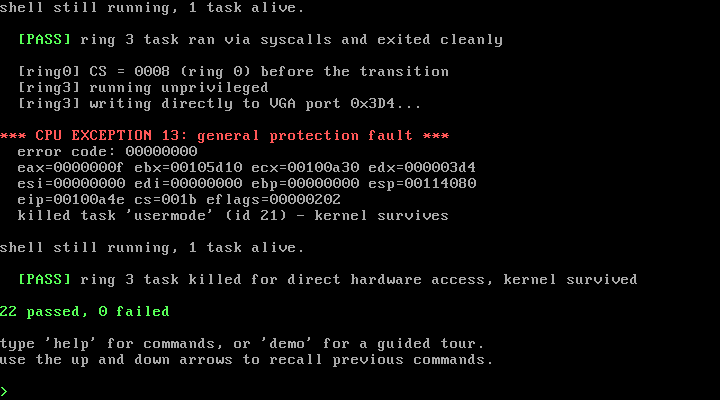
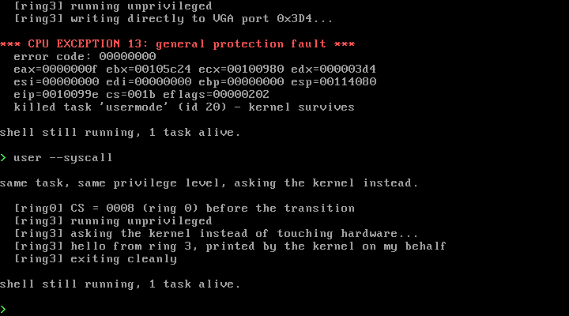
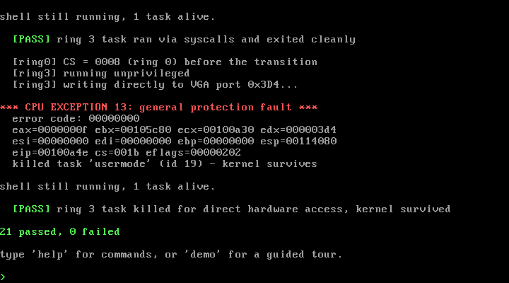
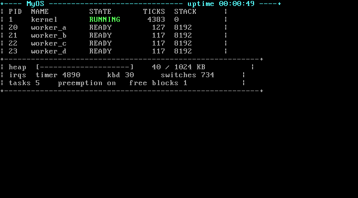

# MyOS — a bare-metal x86 kernel

An educational operating system kernel for 32-bit x86, written from scratch in C and assembly. It demonstrates preemptive multitasking, dynamic memory management, synchronisation, hardware fault handling, virtual memory and privilege separation. Not intended for production use — built to implement the core concepts of an operating system directly on the hardware.

There is no operating system underneath it. No standard library, no `printf`, no runtime. It boots via GRUB, sets up its own descriptor tables, drives the hardware through port I/O, and manages its own memory.



*Preemptive multitasking, a race condition losing updates, and ring 3 privilege separation — recorded from the running kernel.*



*The same task, at the same privilege level. Writing to a hardware port directly gets it killed by the CPU; asking the kernel through a system call succeeds.*

---

## What it demonstrates

| | |
|---|---|
| **Preemptive multitasking** | Round-robin scheduler driven by the timer interrupt. Tasks never yield; the hardware takes the CPU from them. |
| **Context switching** | Register save/restore and stack swapping in assembly. |
| **Dynamic memory** | First-fit heap allocator with block splitting, coalescing, and corruption detection. |
| **Synchronisation** | Spinlock, mutex and counting semaphore, with a race condition demonstrated *failing* before it is fixed, and a bounded-buffer producer/consumer. |
| **Interrupt handling** | Own IDT, exception dispatch, PIC remapping, PIT timer, interrupt-driven PS/2 keyboard. |
| **Virtual memory** | Paging with mixed 4 KB / 4 MB pages, page 0 left unmapped so null dereferences fault. |
| **Privilege separation** | Ring 3 user tasks that can only reach the kernel through `int 0x80`. |
| **Fault containment** | A faulting task is killed; the kernel and shell keep running. |

## Running it

The whole toolchain lives in a Docker image, so nothing needs installing on the host.

```bash
docker build -t myos-dev .
docker run --rm -v "$(pwd):/os" myos-dev make run
```

On Windows PowerShell there is a wrapper:

```powershell
.\dev.ps1 run
```

Then type `demo` for a guided tour, or `help` for the full command list. The up and down arrows recall previous commands.

The 16 commands are: `help`, `demo`, `selftest`, `spawn`, `bg`, `preempt`, `race`, `prodcons`, `fault`, `user`, `tasks`, `top`, `meminfo`, `uptime`, `echo`, `clear`.

| Target | What it does |
|---|---|
| `make` | Build the kernel and a bootable ISO |
| `make run` | Boot it in QEMU, serial output to the terminal |
| `make test` | Boot headless, run the self-test, fail the build if anything fails |
| `make debug` | Boot with QEMU halted, waiting for gdb on `:1234` |

## Verifying it actually works

Printed output proves nothing on its own. A single loop emitting `A B A B` looks exactly like real preemption. Every claim here is therefore backed by one of three things that cannot be faked:

**Ablation** — turn the mechanism off and show the system fails the way theory predicts.

```
> preempt off
> spawn 3
AAAAAAAAAAAAAAAAAAAAAAAABBBB...    one task monopolises the CPU

> preempt on
> spawn 3
AABBCCAABBBCCCAABBCC...            switching resumes
```

**Hardware-authored values** — display registers the CPU wrote, which the kernel never assigned.

```
> fault page 0xdeadb000
*** CPU EXCEPTION 14: page fault ***
  cr2 (faulting address): deadb000     <- written by the CPU, not by us
  cause: page not present, read, kernel mode
  killed task 'faulter' (id 14) - kernel survives
```

**Nondeterminism** — genuine concurrency gives different answers each run; a fake is repeatable.

```
> race off 5
  run 1: 93       <- lost updates
  run 2: 78       <- lost updates
  run 3: 84       <- lost updates
  run 4: 63       <- lost updates
  run 5: 89       <- lost updates

> race on 5
  run 1: 100
  run 2: 100      ... all exact
```

`selftest` runs all 22 checks and reports pass/fail. `make test` runs it headless and fails the build on any failure.



## Live kernel monitor

`top` reads directly from the scheduler's task list and the heap's block list, refreshing on the timer.



## How it works

**Boot.** GRUB finds a multiboot header in the first 8 KB of the kernel image, loads it at 1 MB with the CPU already in 32-bit protected mode, and jumps to `_start`. That stub establishes a stack and calls `kmain`. Using GRUB avoids the entire legacy boot sequence — no boot sector, no real mode, no manual mode switching.

**Output.** VGA text mode is a memory-mapped grid at `0xB8000`; two bytes per cell, character and colour. Everything also goes to the COM1 serial port, which is what survives a crash-reboot and what QEMU can log to a file.

**Interrupts.** A 256-entry IDT routes CPU exceptions and hardware IRQs into assembly stubs that normalise the stack frame and call into C. The PIC is remapped so hardware IRQs arrive on vectors 32–47 — mandatory, because by default IRQ 0 arrives on vector 0, the same vector as the divide-error exception.

**Scheduling.** A task is fundamentally a stack. Switching means saving the callee-saved registers, swapping `esp`, and popping the other task's registers back; the `ret` at the end resumes wherever that task last stopped. New tasks get a hand-built stack frame so the same pop sequence lands in their entry point. The timer handler calls the scheduler, so preemption needs no cooperation from the task.

**Memory.** Paging is identity-mapped, so no pointer changes meaning; what it buys is protection. Above 4 MB uses 4 MB pages, which need no second level at all. The first 4 MB uses 4 KB pages purely so that page 0 can be left unmapped and a null dereference faults.

**Privilege.** User tasks enter ring 3 through an `iret` with a hand-built frame. Once there the CPU refuses privileged instructions, and the only route back into the kernel is `int 0x80` — the single IDT gate with DPL 3.

## Deliberately not built

Naming what was left out, and why, is part of the design:

| | |
|---|---|
| **Custom bootloader** | GRUB handles it. Writing one teaches legacy BIOS trivia, not OS concepts. |
| **64-bit long mode** | Requires paging before any output is possible, which forces the hardest component first for no conceptual gain. |
| **Filesystem** | Needs a disk driver plus a FAT implementation. It is a data structure, not an OS concept — weak return per hour. |
| **GUI / windowing** | Needs a USB host stack for mouse input on real hardware (~10,000 lines before anything appears). |
| **Web browser** | Needs, in order: USB stack, network driver, TCP/IP (~40k lines), TLS (~100k lines), HTTP, then HTML/CSS/JS engines. The dependency chain is the obstacle, not the rendering. |
| **SMP** | Requires APIC, per-core stacks and locking throughout. |

## Known limitations

- **Memory is not isolated between ring 0 and ring 3.** The whole first 4 MB is marked user-accessible, so a ring 3 task could read kernel memory. What *is* enforced is instruction privilege: user code cannot perform port I/O or execute privileged instructions. Separating them properly would mean giving user code its own linker section on its own pages.
- **Syscall arguments are not validated.** `SYS_WRITE` dereferences a user-supplied pointer without checking it.
- **The scheduler is round-robin only** — no priorities, no aging, no blocking wait queues (`sem_wait` yields in a loop rather than sleeping).
- **The race-variance self-test is statistical** and could in principle flake, since how many updates are lost depends on where preemption lands.

## Project structure

```
kernel/
  boot.asm      multiboot header, entry point, stack setup
  linker.ld     memory layout; puts the multiboot header first
  isr.asm       assembly stubs for all 256 interrupt vectors
  context.asm   the context switch
  kmain.c       entry point and subsystem bring-up
  vga.c         VGA text mode
  serial.c      COM1 debug channel
  console.c     kprintf, panic; fans output to both channels
  gdt.c         segment descriptors, TSS
  idt.c         interrupt descriptor table
  isr.c         exception and IRQ dispatch
  pic.c         8259 remap
  pit.c         timer
  keyboard.c    PS/2 scancode decoding
  paging.c      page directory, MMU enable
  heap.c        kmalloc / kfree
  task.c        tasks and the scheduler
  sync.c        spinlock, mutex, semaphore
  string.c      memset/memcpy/strcmp/strtoul — no libc exists here
  syscall.c     int 0x80 dispatch, ring 3 entry
  shell.c       interactive command loop
  monitor.c     live kernel display
  demos.c       the demonstrations
  selftest.c    automated verification
```

Roughly 4,700 lines across 44 files.

## Built with

`gcc -m32 -ffreestanding`, NASM, GNU ld with a custom linker script, GRUB 2 (Multiboot 1), QEMU, and GDB. Everything runs inside the provided Docker image.

## References

- [The Little Book About OS Development](https://littleosbook.github.io)
- [OSDev Wiki](https://wiki.osdev.org)
- Intel Software Developer's Manual, Volume 3 — protected mode, descriptors, exceptions
- Multiboot Specification 0.6.96
